# ***<center><font color="red"> LovinEscapades-API</font>***: The Ultimate Trip Tracking Tool!</center>
## <center> A Django web app </center>

### **Table of content:**
- [Overview](#overview)
- [Application Development](#application-development)
- [Main Features](#main-features)
- [Project Structure](#project-structure)
- [API Endponts](#api-endpoints)
- [Technologies Used](#technologies-used)
- [Accessibility and Design](#accessibility-and-design)
- [Usage and Screenshots](#usage-and-screenshots)
- [Database Schema](#database-schema)
- [Online Validators](#online-validators)
- [Unit Testing](#unit-testing)
- [Manual Testing](#manual-testing)
- [Heroku Deployment](#heroku-deployment)
- [Contributing](#contributing)
- [License](#license)
- [Acknowledgements](#acknowledgements)
- [Documentation version](#documentation-version)

## Overview


### **Project Description**
LovinEscapades-API is a powerful API developed using Django and Django REST Framework, crafted to facilitate user interaction and content management with a strong focus on social connectivity and media sharing. 

The API encompasses four interconnected modules: Profile, Trips, Likes, and Followers, each offering targeted functionality. It allows full CRUD operations for trips and images, empowering users to efficiently manage their travel experiences. Built with adherence to RESTful principles, the API is well-documented to ensure ease of adoption for developers. Looking forward, the integration of a React frontend is planned to deliver an enhanced user experience, along with the potential use of mapping libraries for improved trip visualization.

### **Project Inspiration**
This backend API project builds upon the knowledge and skills acquired during the development of "LovinEscapades" Django web application completed as part of Milestone Project 4 at Code Institute ([more here](https://github.com/eneliviu/LovinEscapades.git)).

### **Public Access:**
* **Trip Exploration:** Unregistered users may have the ability to view public trip locations displayed on a map.
* **Content Discovery:** Access to shared trip details and images is available, subject to privacy settings.

### **Future Considerations:**
* Development of a user-friendly frontend React app to enhance the interactive user experience.
* Integration with mapping libraries for more dynamic trip visualization.
* Exploration of potential social features to facilitate user interaction and community building.

### **Disclaimer:**
This API acts as a foundational backend for a potential application. The outlined features and functionalities may evolve or change based on ongoing development and user feedback.

## Application development
This application was developed using an iterative approach, following Agile principles.

**User Stories & Epics**
I employed a user-centric approach, defining key epics and user stories to guide project development.

**Example Epic**:
Epic: As an API developer,
I want to implement robust and secure user authentication,
so that API consumers can securely access and interact with protected resources.

**Example User Story**:
As an API consumer,
I can authenticate with the API using JWT (JSON Web Tokens),
So that I can access protected resources and perform authorized actions.

**Key Epics**:
* User Authentication: Implement secure and reliable user authentication.
* Trip Management: Enable users to create, manage, and share trip plans.
* Social Interaction: Allow users to interact with other users and their content (e.g., liking posts, following users).
* API Documentation: Provide comprehensive and user-friendly API documentation.


All critical user stories identified as "must-have" were successfully implemented within the project timeline.


*<center><font color="red">LovinEscapades</font>: Github Kanban baord with project User stories*.</center><br>


*<center><font color="red">LovinEscapades</font>: Custom template for User Stories*.</center><br>

This project builds upon the "LovinEscapades" project from Milestone Project 4 at Code Institute. It provides an opportunity to apply API development concepts and enhance my understanding of backend development principles. During development, I focused on code quality and maintainability, adhering to the DRY principle and utilizing frequent Git commits for effective version control.


[*Back to top*](#)


## Main Features

### **Robust User Registration and Authentication:**
* Utilizes JSON Web Tokens (JWT) for secure and stateless user authentication.
* Eliminates the need for server-side session management, improving security and scalability.
* The API provides token refresh endpoints for maintaining continuous user sessions without requiring frequent re-authentication.
* Implement robust user registration, login, logout, and password management functionalities.

### **Comprehensive Trip Management:**
* Enable users to create, retrieve, update, and delete their travel itineraries.
* Facilitate the upload, storage, and association of images with specific trips.
* Allow users to filter and search for trips based on various criteria, such as destination, travel dates, and user preferences.

### **Support for Location Mapping:**
* Provide trip locations as coordinates (Lat, Lon) for potentially mapping the trip itineraries

### **Engaging Social Features:**
* Empower users to connect with other travelers by following other users.
* Enable users to express their interest in trips by liking posts.

### **Well-Defined API:**
* The API adheres to RESTful principles and provides clear and concise documentation for developers.
* Includes comprehensive API documentation generated using tools like Swagger-UI and Redoc
* Provides a smooth user experience by handling errors gracefully and delivering helpful messages.

More details about the API are provided in the [Usage and Screenshots](#usage-and-screenshots) section.

[*Back to top*](#)

## Project structure

### ***Lovingescapades-API*** project consists of four apps:

### 1. Profile App - Overview
The Profile app is designed to manage user profiles within the system. It provides functionalities such as creating, updating, and retrieving user profiles, and extends JWT capabilities for authentication.
The user profile app offers two primary sections:
- **Profile Update Section:** Empowers users to modify their essential details, such as username, first and last name, passwords and to remove their profiles.
- **Content Management:** Allows users to manage their posted trips and images, including functionalities for editing and organizing their content.

#### Models
- **Profile:** This model associates with the default Django `User` model via a one-to-one relationship. It stores information like the user's name, alias, content, and an optional profile image saved on Cloudinary. It tracks the creation and update timestamps and ensures that deleting a profile also deletes the associated user.

#### Serializers
- **ProfileSerializer:** Manages the serialization and deserialization of Profile instances. It includes various computed fields such as the number of trips, images, likes, followers, and followings related to a profile. It incorporates logic to check if the current user is the profile owner and allows image uploads.

#### Views
- **ProfileList:** A read-only API view that returns a list of all profiles with annotated counts for trips, images, followers, and following. It supports filtering and ordering based on various fields.
- **ProfileDetail:** An API view that allows retrieving, updating, or deleting a specific profile. Access to update or delete is restricted to the profile owner.
- **ExtendedTokenObtainPairView:** Extends JWT's `TokenViewBase` to support extra validations on username and password before token issuance. This custom endpoint helps enhance security during the authentication process.

The Profile app employs Django signals for automated Profile creation on User creation, Cloudinary for image management, and JWT for secure authentication.


### 2. Trips App - Overview
The Trips app offers a comprehensive suite of features for managing user trips and their associated images. It supports the following functionalities:

- **Creation, Filtering, and Viewing:** Users can create, filter, and view trips and related images with ease, while ensuring user permissions are respected.
- **Real-Time Counts:** The app provides updated statistics on trips, uploaded photos, and testimonials awaiting approval, enhancing user awareness.
- **Privacy Controls:** Users have the flexibility to choose whether their trip information is public or private. Public trips are displayed on the landing page map, while private trips remain visible only to the authenticated user.
- **Trip Card Access:** Users can quickly access essential trip details through trip card elements, which include vital information like destination and travel dates. These cards also offer convenient options to edit or delete trips and manage photos.

#### Models
- **Trip:** Represents a user's travel experience, storing detailed information such as location, date range, category, and status. It includes functionalities for geolocation and validation to ensure data integrity. The model enhances user interaction by tracking trip ownership and sharing status.
- **Image:** Stores images related to trips, allowing users to upload photos with titles and descriptions. Image validation ensures proper format and size before saving.

#### Serializers
- **TripSerializer:** Manages serialization and deserialization processes for Trip instances, incorporating fields like owner, category, date range, and associated images. It includes methods for computing counts of images and likes, ensuring data consistency and user-friendly representation.
- **ImageSerializer:** Handles image validation and serialization, enforcing file size and format restrictions while providing detailed output, including the number of likes and uploader information.

#### Views
- **TripList:** An API view for listing and creating trips. It integrates extensive filtering and searching capabilities, allowing users to find trips based on various criteria and create new ones linked to their account.
- **TripDetail:** Allows authenticated users to retrieve, update, or delete specific trips. The view leverages query annotations to provide additional context, such as images and likes count.
- **ImageList:** Manages the retrieval and creation of trip-related images, with filtering options for attributes like shared status and upload date. It emphasizes user permissions to ensure that only authorized users can modify the images they own.
- **ImageDetail:** Facilitates retrieving, updating, or deleting a specific image related to a trip. This view enforces strict ownership checks to maintain data security.
- **ImageListGallery & ImageListGalleryDetail:** Focus on providing and managing a gallery of shared images, appealing to authenticated users for secure content creation while allowing public access for viewing.


### 3. Likes App - Overview
The Likes app manages user interactions by allowing users to like images within the system.
It provides functionality to create and track likes, enhancing user engagement with content.

#### Models
- **Like:** Represents a user's "like" on an image. It includes references to the user and the associated image, with a timestamp of when the like was made. Each user can only like a specific image once, enforced by a unique constraint.

#### Serializers
- **LikeSerializer:** Handles the serialization and deserialization of Like instances. It includes fields for the like ID, creation timestamp, owner, and associated image. The serializer ensures that a user cannot like the same image more than once, raising a validation error for duplicates.

#### Views
- **LikeList:** Provides API endpoints to list all likes or create a new like. It requires user authentication for creating likes, assigning the current user as the like's owner.
- **LikeDetail:** Offers functionality to retrieve or delete a specific like, with permissions ensuring that only the owner can delete it. This maintains user control over their own interactions.


### 4. Followers App - Overview
The Followers app facilitates user connections within the system by managing follower relationships, allowing users to follow one another. This promotes community building and interaction. Additional features include:
- **Photo Publication Flexibility:** Users have the option to share photos publicly even if the associated trip information remains private.
- **Photo Details and Interaction:** Each photo in the gallery displays a like icon and basic trip details

#### Models
- **Follower:** Represents a follower relationship between two users. It records which user is following another. The model ensures data integrity by preventing users from following themselves and avoiding duplicate follow records.

#### Serializers
- **FollowerSerializer:** Handles the conversion of Follower model instances to and from JSON. It includes read-only fields for displaying the usernames of both the follower and the followed user. The serializer also checks for duplicate follow attempts, raising a validation error if necessary.

#### Views
- **FollowerList:** An API view for listing all followers or creating a new follower relationship. Authenticated users can follow others, with the requester being set as the follower (owner).
- **FollowerDetail:** Allows users to retrieve or delete a specific follower relationship. The view enforces strict permissions so only the follower (owner) can delete the relationship, maintaining user control over their follow connections.

[*Back to top*](#)

## API Endpoints
The following table provides an overview of the available API endpoints for the LovinEscapades-API:

| Endpoint | Method | Description | Permission |
|---|---|---|---|
| `/dj-rest-auth/registration/` | POST | Register a new user | Public |
| `/dj-rest-auth/user/` | GET | Retrieve user data | IsAuthenticated |
| `/api-auth/login/` | POST | Login a user and obtain a JWT token | Public |
| `/api-auth/logout/` | POST | Logout a user and invalidate the JWT token | IsAuthenticated |
| `/api-auth/token/refresh/` | POST | Refresh the JWT token | IsAuthenticated |
| `/profiles/` | GET | Retrieve the list of user profiles | IsAuthenticatedOrReadOnly |
| `/profiles/<id>/` | GET | Retrieve a specific user profile | IsAuthenticated (IsOwner for updating own profile) |
| `/profiles/<id>/` | PUT | Update a specific user profile | IsAuthenticated (IsOwner) |
| `/profiles/<id>/` | DELETE | Delete a specific user profile | IsAuthenticated (IsOwner) |
| `/trips/` | GET | List all shared trips | IsAuthenticatedOrReadOnly |
| `/trips/` | POST | Create a new trip | IsAuthenticated |
| `/trips/<id>/` | GET | Retrieve a specific trip | IsAuthenticatedOrReadOnly |
| `/trips/<id>/` | PUT | Update a specific trip | IsAuthenticated (IsOwner) |
| `/trips/<id>/` | DELETE | Delete a specific trip | IsAuthenticated (IsOwner) |
| `/trips/<id>/images/` | GET | List all images for a specific trip | IsAuthenticatedOrReadOnly |
| `/trips/<id>/images/` | POST | Upload a new image | IsAuthenticated (IsOwner of the trip) |
| `/trips/<trip_id>/images/<image_id>` | GET | Retrieve a specific image for a specific trip | IsAuthenticatedOrReadOnly |
| `/trips/<trip_id>/images/<image_id>` | PUT | Update a specific image for a specific trip | IsAuthenticated (IsOwner of the image) |
| `/trips/<trip_id>/images/<image_id>` | DELETE | Delete a specific image for a specific trip | IsAuthenticated (IsOwner of the image) |
| `/images/` | GET | Retrieve all shared images | IsAuthenticatedOrReadOnly |
| `/images/<id>/` | GET | Retrieve a specific image | IsAuthenticatedOrReadOnly |
| `/followers/` | GET | List all followers or follow a new user | IsAuthenticated |
| `/followers/<id>/` | GET | Retrieve a specific user | IsAuthenticatedOrReadOnly |
| `/followers/<id>/` | DELETE | Unfollow a specific user | IsAuthenticated |
| `/likes/` | GET | List all likes or like a new trip | IsAuthenticated |
| `/likes/<id>/` | GET | Retrieve a specific trip | IsAuthenticatedOrReadOnly |
| `/likes/<id>/` | DELETE | Unlike a specific trip | IsAuthenticated |


A comprehensive overview of the API endpoints, including detailed documentation, is available through [Swagger-UI](https://drf-backend-api-70211104c0c7.herokuapp.com/schema/swagger-ui/), [Redoc](https://drf-backend-api-70211104c0c7.herokuapp.com/schema/redoc/) or directly in [yaml](https://drf-backend-api-70211104c0c7.herokuapp.com/schema/) format.


[*Back to top*](#)

## Technologies Used

### **Django Rest Framework:**
- A web framework made with Python that helps build web apps quickly and efficiently. It's great for managing databases and organizing code, making it easier to create complex features.

### **Geopy Python Module:**
- A library that helps find geographic coordinates, like latitude and longitude, from place names. It’s used to show trip locations accurately on the map.

### **Django graph models:**
- [Django Extensions](https://shorturl.at/GxkSs) is a collection of custom extensions for the Django Framework that can be used for creating ER (Entity-Relationship) diagrams for the project database. These diagrams make it easier to visualize, understand, and manage the database structure. You can view these database model relationships using the online [GraphViz generator](https://shorturl.at/AAuhy).

### **Python modules**
The following Python modules were installed using the `pip install` command in the terminal and were listed in the [`requirements.txt`](requirements.txt) file.

### **Markdown**
* The Markdown formatting for README.md and HELP.md files was done according to the documentation provided at
[www.markdownguide.org](https://www.markdownguide.org/basic-syntax/).

### Cloudinary serving
This project utilizes Cloudinary for efficient and secure image storage and delivery.

### Cloud deployment
* The app is currently deployed on [Heroku Cloud Application Platform](https://www.heroku.com)
* For cloud deployment, the [dependency requirements file](requirements.txt) was compiled using the following command:
```
pip freeze --local > requirements.txt
```

* The processes to run on the Heroku platform are specified in the `Procfile` file.
* Sensitive information is stored in the `env.py` file, which is listed in the `.gitignore` to prevent it from being uploaded to GitHub.
* The app can be accessed at [***LovinEscapades-api***](https://github.com/eneliviu/drf-backend-api.git).

### Local deployment
* For development or deployment on a local development, the web server can be started using the terminal command:

```
python manage.py runserver
```

[*Back to top*](#)


## Screenshots API endpoints

Below are screenshots showcasing our API endpoints, providing a visual guide to the functionality and responses available through the system.

<p align="center">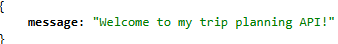</p>

### The main API endpoints

#### Profile list and details

<p align="center">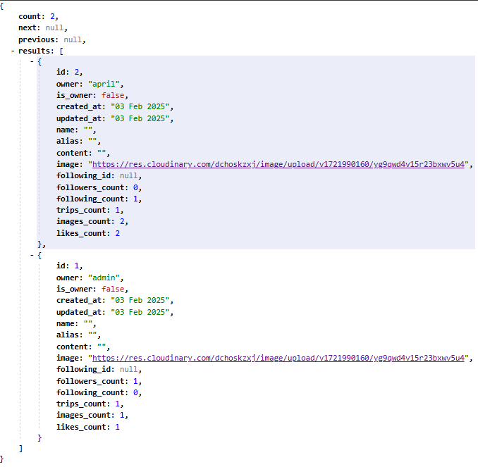</p>
<p align="center">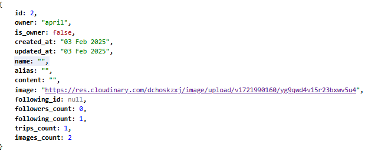</p>

#### Trips list and details with nested images
<p align="center">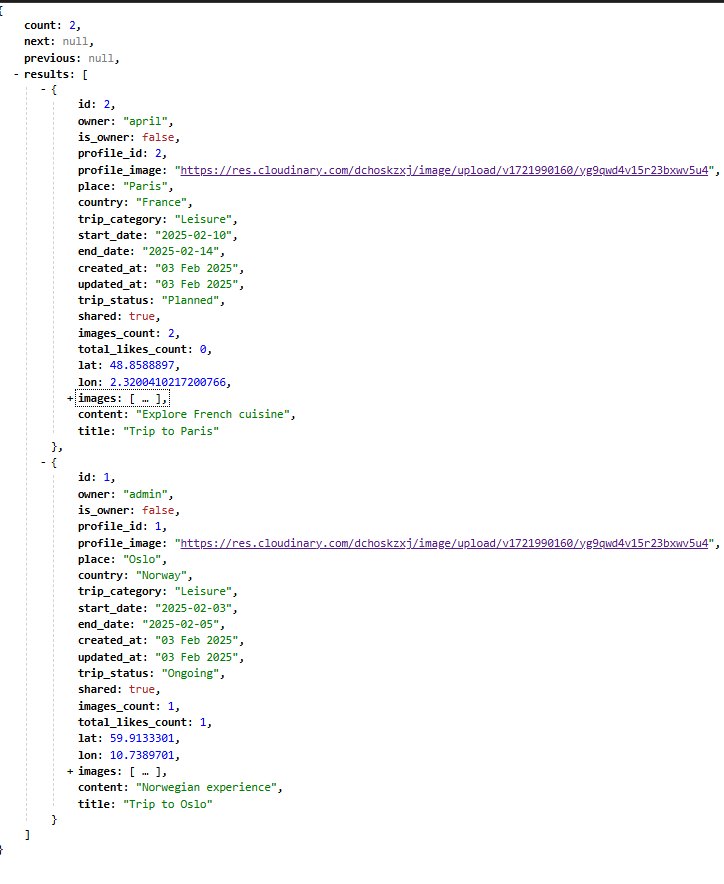</p>
<p align="center">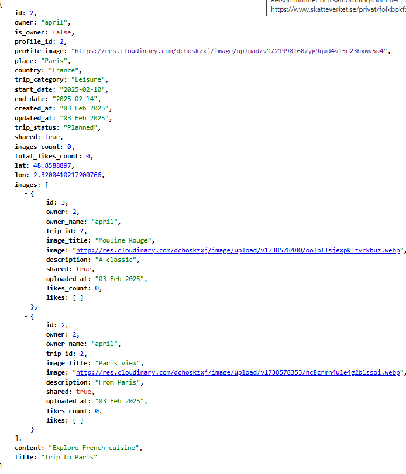</p>

#### Likes
<p align="center">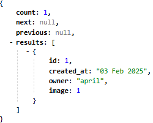</p>
<p align="center">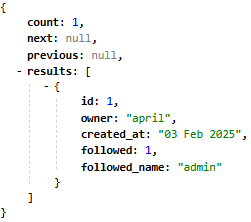</p>

## Entity Relationship Diagram (EDR)

The EDR for the full project database shcema was produced using the
[Graph models extention](https://shorturl.at/psHzX) and visualized using the online [GraphViz generator](https://shorturl.at/AAuhy). 

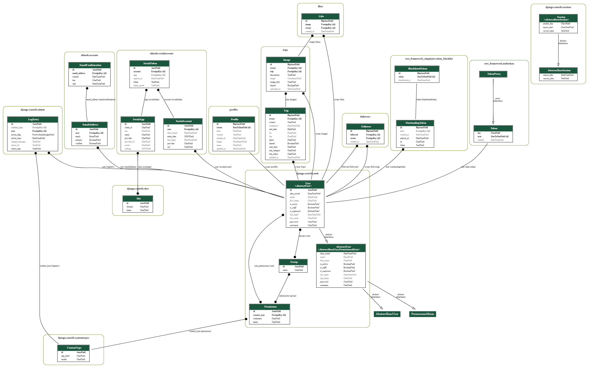
<p align="center"><strong>EDR project database diagram</strong></p>

The database models in more detail are presented below:

<p align="center">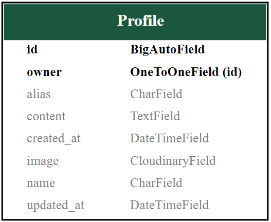</p>
<p align="center">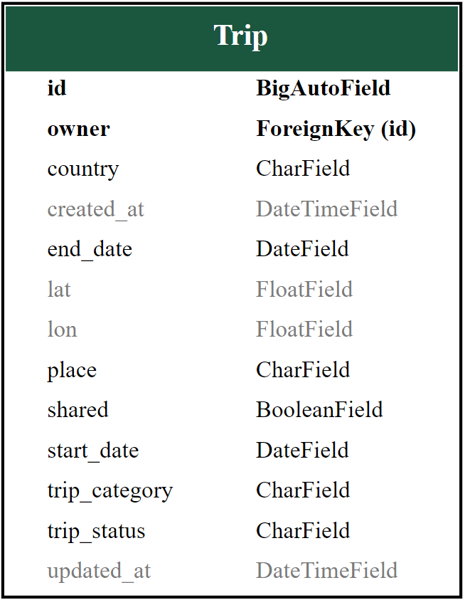</p>
<p align="center">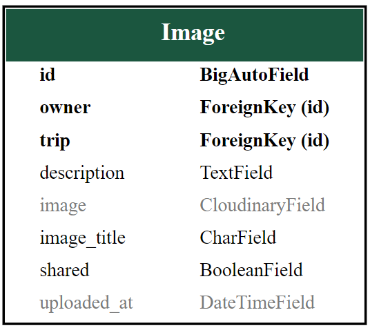</p>
<p align="center">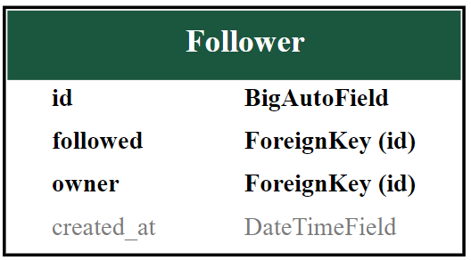</p>
<p align="center">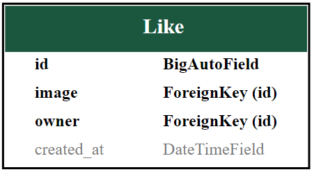</p>

## Online Validators

### **PEP8**
The [Pep8 CI](https://pep8ci.herokuapp.com/) Python Linter returned no errors:
| App            | File         | CI Linter Result           |  Status |
| --- | --- | --- | --- |
| `trips`        | `models.py`  |All clear, no errors found |  `pass`|
|                | `serializers.py`  | All clear, no errors found |  `pass`|
|                | `utils.py`   | All clear, no errors found |  `pass`|
|                | `urls.py`    | All clear, no errors found |  `pass`|
|                | `views.py`   | All clear, no errors found |  `pass`|
| `profiles`     | `models.py`  | All clear, no errors found |  `pass`|
|                | `serializers.py`  | All clear, no errors found |  `pass`|
|                | `urls.py`    | All clear, no errors found |  `pass`|
|                | `views.py`   | All clear, no errors found |  `pass`|
| `followers`    | `models.py`   | All clear, no errors found |  `pass`|
|                | `serializers.py`  | All clear, no errors found |  `pass`|
|                | `urls.py`    | All clear, no errors found |  `pass`|
|                | `views.py`   | All clear, no errors found |  `pass`|
| `likes` | `models.py`   | All clear, no errors found |  `pass`|
|                | `serializers.py`  | All clear, no errors found |  `pass`|
|                | `urls.py`    | All clear, no errors found |  `pass`|
|                | `views.py`   | All clear, no errors found |  `pass`|
---


## Unit testing
The project includes a comprehensive test suite for the Trip and Image API endpoints.
The tests are located in the `trips/tests.py` file and cover the following views:
- **TripListView**: Tests for listing trips, including handling shared and non-shared trips.
- **TripDetailView**: Tests for retrieving a specific trip using valid and invalid IDs.
- **ImageListView**: Tests for listing images associated with trips, including handling shared and non-shared images.
- **ImageDetailView**: Tests for retrieving a specific image associated with a trip using valid and invalid IDs.
- **ImageModel**:  Test suite for the Image model, including creating and updating images with valid and invalid data.
- **ImageModelValidation**:  Test suite for validating the Image model's save method to ensure that it correctly validates new and updated images, particularly focusing on the validation of the image file extension.

The test suite includes setup methods to initialize test data and individual test methods to verify the functionality of the respective endpoints.

### Test Classes
1. **TripListViewTests**:
    * Verifies the functionality of listing trips through the `TripListView` endpoint.
    * Tests include:
        * Listing trips that are shared.
        * Handling trips that are not shared.
2. **PostDetailViewTests**:
    * Verifies the functionality of retrieving a trip through the `TripDetailView` endpoint.
    * Tests include:
        * Retrieving a trip using a valid ID.
        * Handling retrieval of a trip using an invalid ID.
3. **TripImageListViewTests**:
    * Verifies the functionality of listing images through the `ImageListView` endpoint.
    * Tests include:
        * Listing images that are shared.
        * Handling images that are not shared.
4. **TripImageDetailViewTests**:
    * Verifies the functionality of retrieving an image through the `ImageDetailView` endpoint.
    * Tests include:
        * Retrieving an image using a valid ID.
        * Handling retrieval of an image using an invalid ID.
5. **ImageModelTests**:
    * Verifies the functionality of the Image model, including creating and     updating images with valid and invalid data.
    * Tests include:
        * Creating an Image instance with valid data.
        * Creating an Image instance with an invalid image file extension.
        * Updating an Image instance with a new valid image.
        * Updating an Image instance with an invalid image file extension.
        * Testing the `__str__` method of the Image model.
6. **ImageModelValidationTests**:
    * Verifies the validation logic of the Image model's save method.
    * Tests include:
        * Validating a new image with an invalid extension.
        * Validating an updated image with an invalid extension.

### Running Tests
To run the tests, use the following command:
```bash
python manage.py test
```
This command will execute the test suite and display the results in the terminal.

The tests cover various scenarios to ensure the correctness and robustness of the API endpoints.

<p align="center"><strong>Table: Overview of Test Classes and Methods for the Trip and Image API Endpoints</strong></p>

| Type    | Name                                         | Description                                                                                                    | Expected Status |Result                     |
|---------|----------------------------------------------|-------------------------------------------------------------------------------------------|-------------------------------------|--------------------------|
| Class   | `TripListViewTests`                          | Test suite for the TripListView. Checks listing of trips including shared and non-shared.          | -            |
| Method  | `test_can_list_trips`                        | Verifies that trips can be listed through the TripListView endpoint.                  | Status code: 200 OK       | `pass`|
| Method  | `test_can_handle_list_trips_not_shared`      | Verifies handling of trips that are not shared.                                       | Status code: 200 OK       | `pass`|
| Class   | `PostDetailViewTests`                        | Test suite for the TripDetailView. Tests retrieving trips using valid and invalid IDs.| -                         |
| Method  | `test_can_retrieve_post_using_valid_id`      | Ensures a trip can be retrieved by a valid ID.                                        | Status code: 200 OK        | `pass`|
| Method  | `test_can_retrieve_post_using_invalid_id`    | Ensures appropriate handling of requests with an invalid trip ID.                     | Status code: 404 Not Found | `pass`|
| Class   | `TripImageListViewTests`                     | Test suite for the ImageListView. Checks listing of images including shared and non-shared. | -                    |
| Method  | `test_can_list_trip_images`                  | Verifies that images can be listed through the ImageListView endpoint.                | Status code: 200 OK        | `pass`|
| Method  | `test_can_handle_list_trip_images_not_shared`| Verifies handling of images that are not shared.                                      | Status code: 200 OK        | `pass`|
| Class   | `TripImageDetailViewTests`                   | Test suite for the ImageDetailView. Tests retrieving images using valid and invalid IDs.| -                        | `pass`|
| Method  | `test_can_retrieve_trip_image_using_valid_id`| Ensures an image can be retrieved by a valid ID.                                        | Status code: 200 OK      | `pass`|
| Method  | `test_can_retrieve_trip_image_using_invalid_id`| Ensures appropriate handling of requests with an invalid image ID.   | Status code: 404 Not Found | `pass`|
| Class   | `ImageModelTests` | Test suite for the Image model. Tests creating and updating images with valid and invalid data.| -  | `pass`|
| Method  | `test_create_image_with_valid_data`|Verifies that an Image instance can be created with valid data. | - | `pass`|
| Method  | `test_create_image_with_invalid_image_extension`|Verifies that an Image instance cannot be created with an invalid image file extension. | Raises ValidationError | `pass`|
| Method  | `test_update_image_with_valid_image`|Verifies that an Image instance cannot be created with an invalid image file extension. | - | `pass`|
| Method  | `test_update_image_with_invalid_image_extension`|Verifies that an Image instance cannot be updated with an invalid image file extension. | Raises ValidationError | `pass`|
| Method  | `test_image_str_method`|Verifies the `__str__` method of the Image model. | - | `pass`|
| Class   | `ImageModelValidationTests`  | Test suite for the Image model. Tests creating and updating images with valid and invalid data.| -  | `pass`|
| Method  | `test_save_method_validates_new_image`|Verifies that the save method raises a ValidationError for a new image with an invalid extension. | Raises ValidationError | `pass`|
| Method  | `test_save_method_validates_updated_image`|Verifies that the save method raises a ValidationError for an updated image with an invalid extension. | Raises ValidationError | `pass`|


## Manual Testing
The manual testing section aims to validate the functionality, security, and integration of the backend API beyond automated tests.
This testing strategy ensures that the API operates correctly under various conditions, including functional interactions, user authentication, edge cases like large data inputs, and data consistency. Additionally, it verifies successful integration with services like Cloudinary for image handling.

| **Test Type**    | **Description and Steps**    | **Expected Result**  |  **Status** |
|------------------|------------------------------|----------------------|----------------------|
| **Functional Testing**               | 1. **List Trips:** Send a GET request to `/trips/`. Verify the response contains a correct list of trips. <br/>2. **Create Trip:** Send a POST request with valid trip data to `/trips/`. Verify that the trip is added correctly. | Successful responses with correct data format and content. |   `pass`|                                                             |
| **Authentication and Authorization Testing** | 1. Attempt to access a protected endpoint `/profiles/` without logging in. <br/> 2. Log in with valid credentials and try again. Verify access is granted. | Unauthorized returns 401/403 for unauthorized users. Authorized users can access and perform actions according to their roles. |   `pass`|
| **Edge Case Testing (Large Images)** | Attempt to upload an >2MB image file <br/>  | System should handle the file gracefully by rejecting with a validation error. |   `pass`|
| **Data Integrity Testing** | 1. Retrieve trip details using a GET request to `/trips/{id}/`. <br/> 2. Update the trip using a PATCH request with modified data. <br/> 3. Retrieve the updated trip to confirm changes are saved. | Data is consistently updated across requests, and changes persist correctly after updates. |   `pass`|
| **Third-Party Service Testing (Cloudinary)** | 1. Upload an image using the API. <br/> 2. Verify image is stored in Cloudinary and the response contains the correct URL. <br/> 3. Delete the image using the API and check it's removed from Cloudinary. | Image is correctly uploaded and referenced in Cloudinary, and deletions are reflected both locally and in Cloudinary.    |   `pass`|

[*Back to top*](#)


## Heroku Deployment
This project uses Cloudinary for image storage, which allows for efficient and scalable management of images.
To configure Cloudinary,  obtain your cloud name, API key, and API secret. Cloudinary credentials were accessed via
the `CLOUDINARY_URL` environmental variable. Additionally, the project uses CodeInstitute's PostgreSQL database,
accessed via the `DATABASE_URL` environment variable.

### React Client
A React client has been configured to consume the API endpoints provided by the LovinEscapades-API.
This client is also deployed on Heroku, ensuring seamless integration and interaction with the backend API.
The React client handles the frontend functionalities, providing users with an intuitive and responsive interface
to interact with the trip tracking tool.

[*Back to top*](#)

## API documentation


[*Back to top*](#)


## Contributing

### To contribute to the ***LovinEscapades-API*** project:
- Fork the repository on GitHub to create your own copy.
- Clone the forked repository to your local machine.
- To fork the project:
    - Click the "Fork" button on the top-right corner of the repository page
    - Clone Your Fork by running the following command in the terminal or command prompt:
        `git clone https://github.com/your-username/repository-name.git`
- Make your desired changes, whether it's fixing a bug, adding a feature, or updating documentation.
- Commit your changes with clear messages.
- Push your commits to your forked repository on GitHub.
- Submit a pull request detailing your changes and their benefits.

[*Back to top*](#)

## License
### Open Source
As an open-source project, ***LovinEscapades-API*** promotes transparency and community involvement.
The code is accessible on GitHub, allowing developers to view, fork, and contribute to the project as they desire.

[*Back to top*](#)

## Acknowledgements
* [`BugBytes` Youtube channel](https://www.youtube.com/watch?v=qzrE7cfc_3Q) for using Django Graphs and great short examples of using extensions
* `ChatGPT` was utilized to generate sensible input for text content, assist in crafting the README file, and perform language proof-checking.

### Use of GenAI
Generative AI tools, such as ChatGPT, were leveraged in various aspects of this project.
They were utilized to assist in:
* Generating initial drafts of documentation and code comments.
* Ensuring the accuracy and clarity of technical descriptions.
* Identifying and upgrading deprecated libraries within the walkthrough CodeInstitute projects.

[*Back to top*](#)

## Documentation version

Last updated: Feb 3, 2025

[*Back to top*](#)